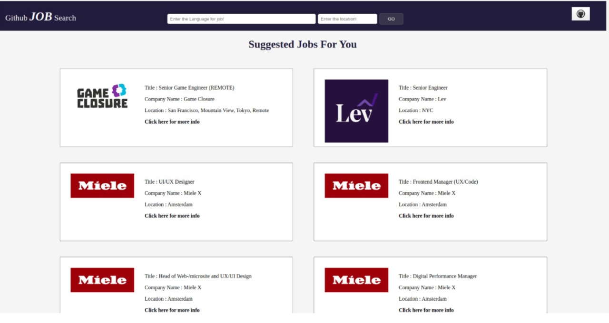

# masai-sprint-3

My sprint_3 is GITHUB JOB SEARCHER. 
Its an application that I have designed and implemented on the idea of API.  
It works by taking input form the user and apply search for personalized requirements before taking any input it randomly shows some job suggestions.
The result of the search comprises of Title, Company Name, Location and for more details there is a link with all the information.
